[中文版](README_CN.md)

# Figure & Table Guide

By [Zhuang Liu](https://liuzhuang13.github.io/).

**Related**: [Writing Guide](https://github.com/zlab-princeton-internal/writing-guide) · [AI Paper Checking](https://github.com/zlab-princeton-internal/ai-paper-checking) · [Peer Review System](https://github.com/zlab-princeton-internal/peer-review) · [Writing Self-Review](https://github.com/zlab-princeton-internal/paper-rating)

> This guide is intended for [Zhuang Liu](https://liuzhuang13.github.io/)'s group members. Others are welcome to adopt or adapt it for their own use.

## General Principle

- In a good paper, a reader should be able to understand your core claims and conclusions just by scanning the key figures and tables — at most glancing at the captions, ideally without reading any body text. If readers must read the text to understand your most important figures, the figures are not clear enough.
- Important figures and tables should have detailed captions. Do not write a one-line or half-line caption for your core results.

## Font (Most Common Issue — Please Get This Right)

- **Please use Arial (or Helvetica) for all text in figures** (diagrams, flowcharts, plots, axis labels, etc.). Do not use serif fonts (e.g., Times New Roman) in figures in any case, unless you are intentional about using a different, more good-looking one.
- **Check legends, titles, ticks, axis labels, and any other text in figures** — make sure they are the appropriate size, close to the caption size. The text can be slightly larger than the caption, but must never be much smaller. The most common mistake is text that is way too small. Always check in the compiled PDF at 100% zoom.

These two points are the most frequently repeated feedback. Get these right and most problems go away.

- **Do not bold text in diagrams/flowcharts.** Bolding does not improve readability — it just looks worse. At most, bold a few specific words for emphasis. Never bold an entire category of text.

## Workflow

- **Sync Overleaf with Dropbox** so that figures you generate locally are automatically synced to Overleaf — no need to manually drag and upload each time. This saves a lot of time. Setup: [Overleaf-Dropbox sync](https://www.overleaf.com/learn/how-to/Dropbox_Synchronization).

## Format

- **Always export figures as PDF** (vector graphics). Never use PNG/JPG for plots. PDF stays sharp when zooming in and text remains selectable.
- **If you make figures with HTML, the PDF must be vector, not raster.** A common mistake: rendering HTML to PNG then converting PNG to PDF — this produces a raster PDF that looks blurry when zoomed in. Instead, use Chrome's `--print-to-pdf` flag to generate a true vector PDF, then crop with `pdfcrop`. Example workflow: `chrome --headless --print-to-pdf=out.pdf --no-pdf-header-footer file.html`, then `pdfcrop out.pdf out_cropped.pdf`.
- **Crop all white space** around figures, so paper space is not wasted. Ensure figures utilize all the available width to the left and right (unless you intentionally leave space). In matplotlib, use `plt.savefig(..., bbox_inches='tight')`. For PDF figures from HTML, use `pdfcrop` (part of TeX Live) to automatically trim all white borders.

## Visual Style

- **Add thin black borders to boxes/rectangles** in diagrams. This makes them look more polished.
- **Use thin, pure black, borderless, sharp arrows** in diagrams (the default thin arrow in PowerPoint/Keynote works well).
- **Text and borders should default to pure black.** Gray can be used for secondary elements (when pure black is already the primary color), but do not make gray the darkest color in the figure — it looks like a webpage, not an academic paper. This applies to arrows too: use pure black arrows, not gray. Gray borders and arrows give the figure a webpage aesthetic rather than an academic paper aesthetic.
- **Text inside boxes should fit the box size.** Do not leave large gaps on all four sides — at least top/bottom or left/right should be close to the box edges.
- Consider a **dark background + white text** style for boxes.

> **Fig. 1** — Thin arrows + thin black borders + dark bg with white text + text fitting the box. From [DyT](https://arxiv.org/abs/2503.10622).
>
> 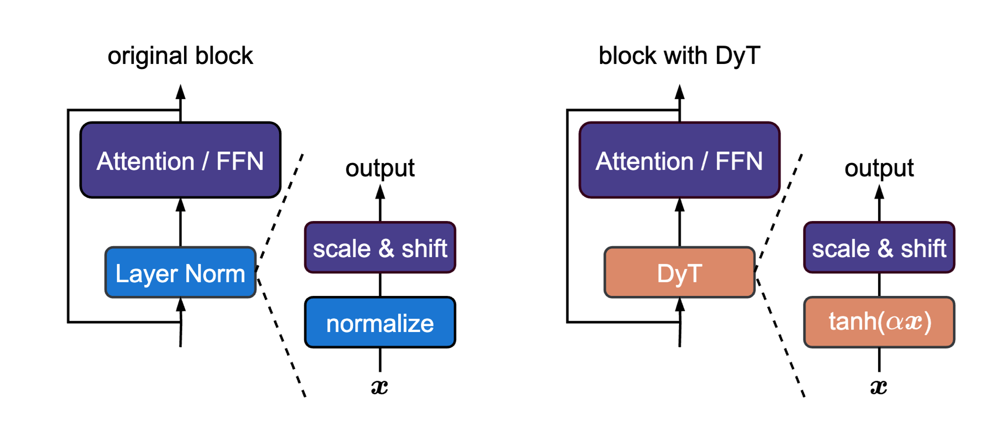

- **Replace unnecessary dividing lines with colored background blocks** (see Fig. 6).
- **Pay attention to the spacing between figure and caption, and between caption and body text.** This spacing is often too large or too small — adjust it manually. Once you are aware of this, you will get it right.
- **Captions go below figures and tables, not above.** Even if conference instructions say otherwise, place them below.
- **Captions must be visually distinct from body text at a glance.** Use `\captionsetup{font=footnotesize}` (or at least `font=small`) so that captions are clearly one or two sizes smaller than body text. When scanning a page, a reader should instantly tell which text is a caption and which is body — if they look the same size, the page feels cluttered and the structure is unclear.
- **Figures should not be too sparse or too crowded internally.** Keep arrows short — they should roughly fill the gap between boxes. Avoid situations where two boxes are far apart with only a tiny arrow in between.
- **Large boxes (e.g., colored prompt blocks) must close on all four sides, even when split across pages.** Each fragment should still look complete (see [Fig. 2](#fig-2)).
- **Remove all vertical lines in tables.** In most cases, the table looks nicer without them. Look at how *Kaiming*'s papers never have vertical lines in tables.

> **Fig. 2** — Box boundary across page break. **Bad** (left): fragments missing top/bottom borders. **Good** (right): each fragment closed on all four sides.
>
> <table><tr>
> <td>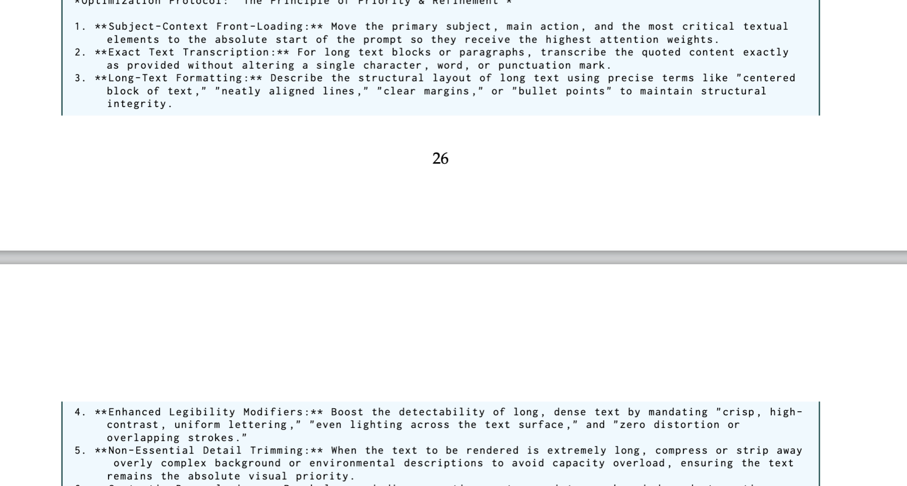</td>
> <td>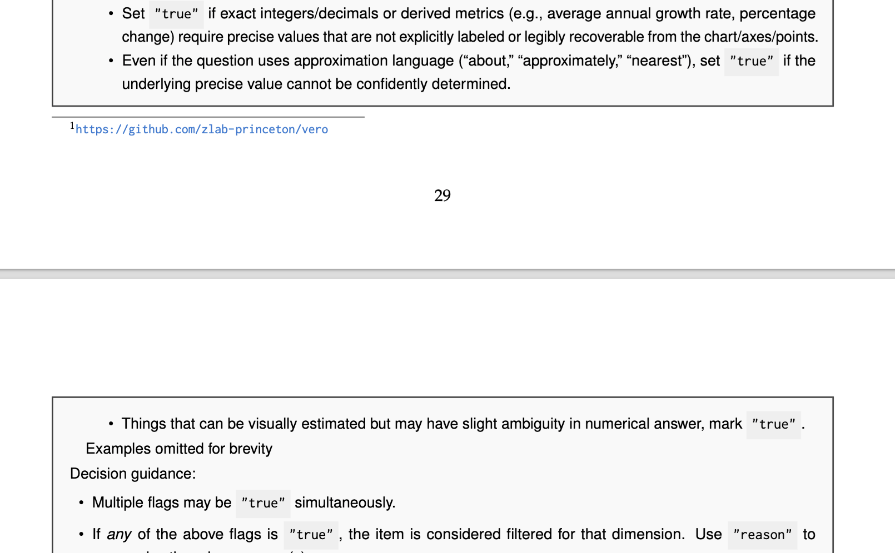</td>
> </tr></table>

## Diagrams & Teasers

- **Express your core idea in one simple figure.** Do not draw overly complex pipeline diagrams (multiple rows, multiple columns, every component annotated with colors). Simpler is better.
- Use **side-by-side comparison** (old method vs. yours) to make the difference immediately clear.
- Pipeline/diagram figures can also be made with HTML (easier to iterate via prompting), but avoid the typical HTML aesthetic: no bold text, no ALL-CAPS phrases, no gray dividing lines, no gray text. Default to black text and normal capitalization. Maintain an academic paper look.
- **When designing with HTML, propose multiple layout options side-by-side before committing.** It is much faster to compare 3–4 parallel designs in one HTML page than to iterate on a single design one tweak at a time. This applies to layout, color schemes, and element positioning.

> **Fig. 3** — One simple figure captures the entire core mechanism. From [MoCo](https://arxiv.org/abs/1911.05722).
>
> 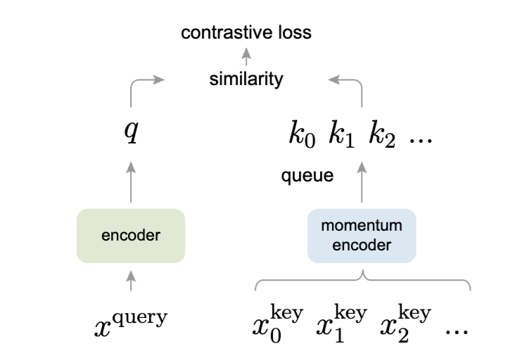

> **Fig. 4** — Three methods side by side, consistent structure, differences obvious at a glance. From [MoCo](https://arxiv.org/abs/1911.05722).
>
> 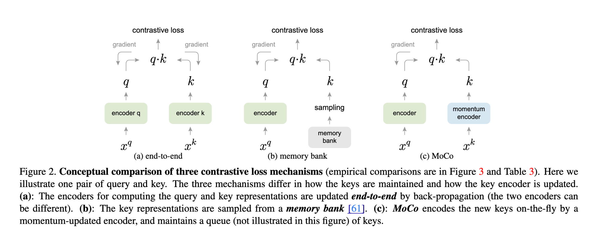

> **Fig. 5** — Left-right comparison with concrete numbers, instantly understandable. From [Wanda](https://arxiv.org/abs/2306.11695).
>
> 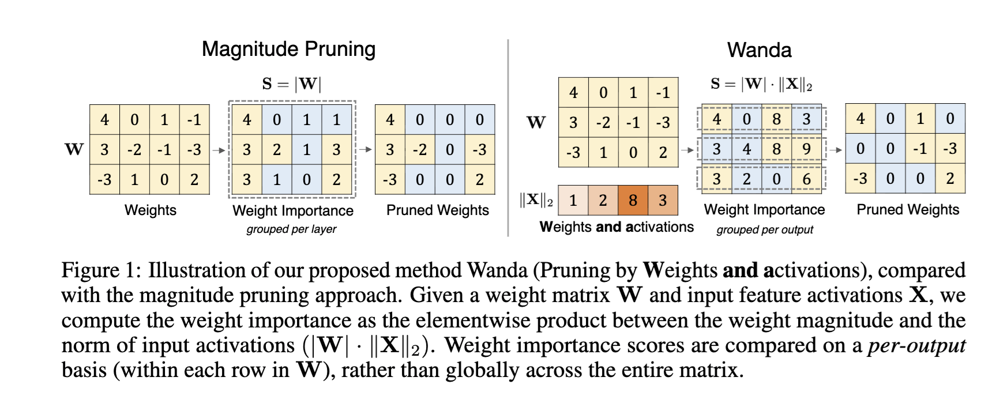

## Content

- If your work involves **vision generation**, you must show generation samples — not just numerical tables and plots.
- **Show concrete examples** (dataset samples, environment screenshots, model outputs, etc.) so readers can see what your data and results actually look like. Especially important for data-centric work.

> **Fig. 6** — Colored background blocks instead of dividing lines for data samples. Color palette reference. From WorldBench (upcoming).
>
> 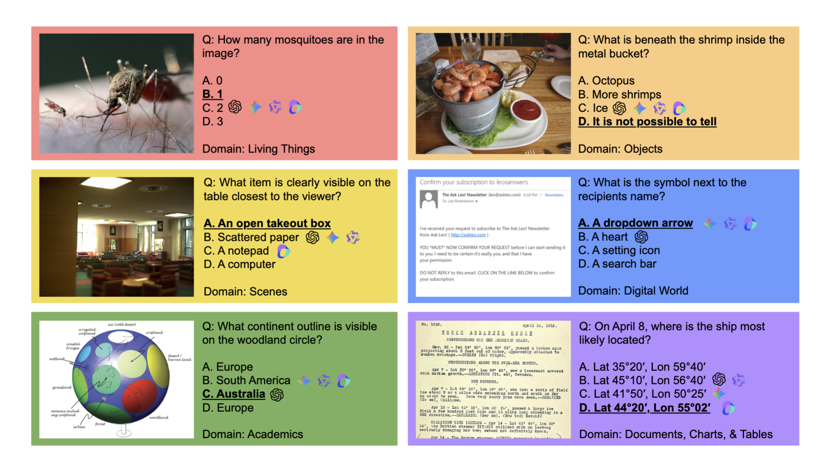

## Pseudocode / Code

- If your method is simple enough, consider including pseudocode or real code (e.g., PyTorch) to describe the core algorithm. This greatly helps clarity.
- Use real code when the method is simple; use pseudocode for more conceptual descriptions.

> **Fig. 7** — A few lines of PyTorch code explain the entire algorithm. From [Wanda](https://arxiv.org/abs/2306.11695).
>
> 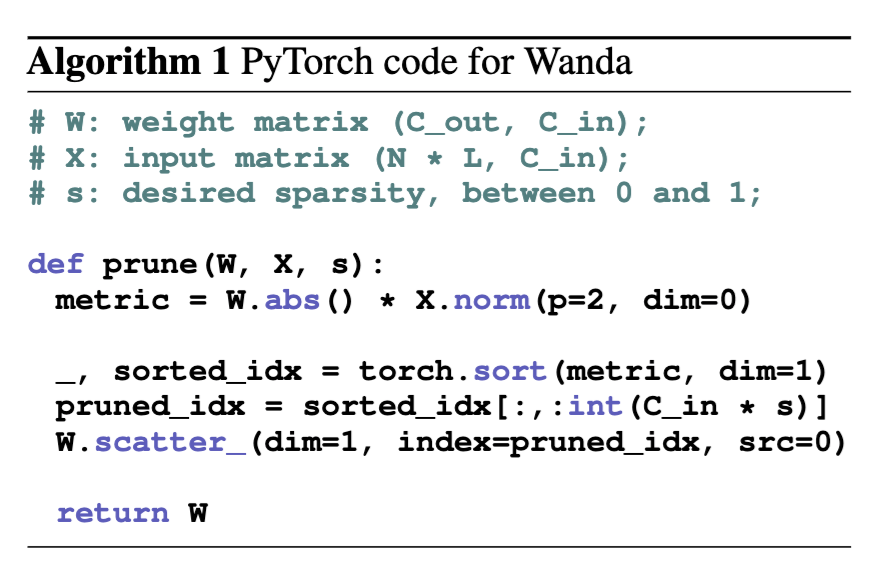

## Layout

- **Important figures should take the full width.** Do not squeeze a key figure alongside unrelated plots to save space. One row should convey one concept. If you only have one important figure, make a related companion figure to fill the row rather than pairing it with an unrelated ablation.
- Less important figures (ablation, side analysis) can share a row (two per row).
- If you cannot fill a row, use `wrapfigure` to embed the figure alongside text. Do not force it.
- **Figures should be within half a page of where they are first referenced.** Early figures (Figure 1/2) can be placed ahead for framing, but from the experiments section onward, keep figures close to their references.
- **Side-by-side figures: the gap between them should be centered on the page** (or close to it). Do not let y-axis labels/ticks push everything to the right — shrink the figures or leave whitespace on the right to maintain visual symmetry. If there is an overall caption, it should also be centered on the page.
- **Vertically align side-by-side subfigures**: the overall visual center of gravity (including titles and labels) should appear level. Design subfigures with consistent structure (both have titles on top, or neither does). If captions are separate ((a) and (b)), their first lines must align, and the number of caption lines should be similar.
- **Avoid placing a narrow/sparse figure at the top of a page with large whitespace on both sides.** If a figure does not fill the column or page width, it leaves awkward empty space — especially noticeable at the top of a page. Either use `wrapfigure` to embed it alongside text, or place it in the middle of the page with text above and below.

> **Bad** — A narrow figure at the top of the page with large whitespace on both sides.
>
> 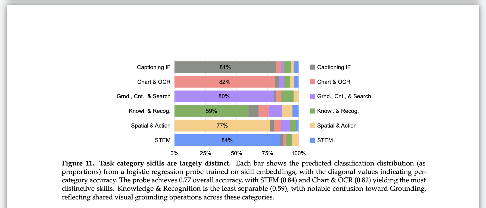
- **Never have two consecutive pages without any figure or table.** Even one page without a figure/table should be rare.

## Variety & Rhythm

- **Use a variety of figure types**: line plots, bar charts, heatmaps, diagrams, etc. Do not use the same type throughout. Table sizes should also vary. But do not force variety for its own sake — keep it natural.
- **Interleave figures and tables** throughout the paper. Do not cluster all figures on one page and all tables on another. The layout should have rhythm and visual appeal.
- **Spread different types of visual content across the paper.** Do not put one big figure at the front and then nothing but tables and plots for the rest. Even colorful tables get tiring page after page — mix in image-heavy figures, qualitative samples, and diagrams throughout.
- See [Cambrian-1](https://arxiv.org/abs/2406.16860) for a good example of figure/table arrangement.

## Plots (matplotlib)

- **Use matplotlib** for plots by default.
- **Line plots and scatter plots should be slightly wider than tall** — a landscape rectangle. Avoid squares, and especially avoid portrait orientation (taller than wide).
- Consider adding **faint dashed grid lines** as background in line plots for better structure and easier value reading.
- **Bar chart bars must be sharp rectangles.** No rounded corners.
- **Iterate on color choices.** Do not pick colors casually. Some recommended colors: **#483e8c**, **#1b76d2**, **#dc8969**. Also refer to DyT and MoCo papers for color schemes, and the colored blocks in Fig. 6 (lighten as needed).
- **Y-axis tick values must be round numbers.** Do not let matplotlib auto-generate tick values from the data range — values like 30.3, 71.1, 96.9 look sloppy and unprofessional. Manually set ticks to clean integers (e.g., 30, 50, 70).

> **Bad** — Y-axis ticks are auto-generated decimals (30.3, 50.8, 71.3, etc.).
>
> 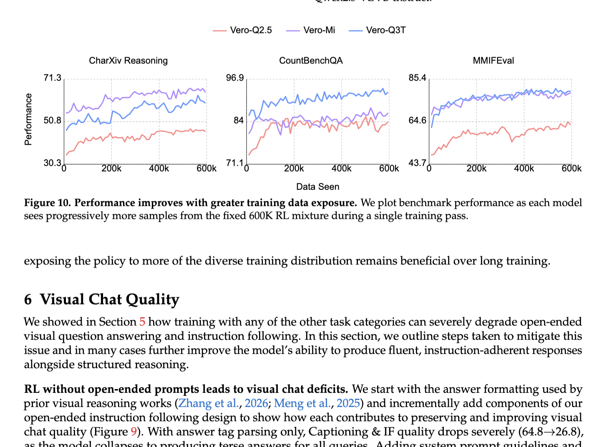

- **Heatmap colors are hard to get right.** See Fig. 8 for a reference.

> **Fig. 8** — Heatmap color scheme reference (red-yellow-green). From WorldBench (upcoming).
>
> 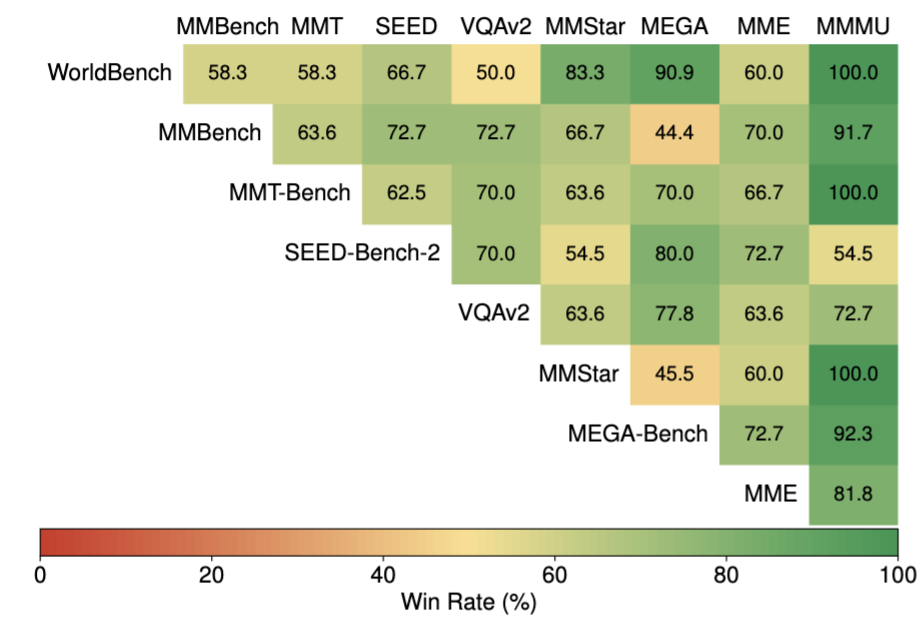

## References

- All figures and tables must be referenced at least once in the text.

## Tools

- **Plots (line charts, bar charts, scatter plots, etc.)**: use matplotlib by default.
- **Flowcharts and diagrams**: for diagrams that can be expressed programmatically (pipelines, flowcharts, architecture overviews), prefer using Claude Code with HTML/CSS or Python over manual tools like PowerPoint/Keynote. Code-based figures are easier to iterate, share, and collaboratively modify — anyone can tweak sizes, colors, and layout without needing the original software. Store the source HTML/Python alongside the PDF in the repo. Fall back to PowerPoint/Keynote for diagrams that require heavy manual arrangement. Do not use Google Slides — the output quality is generally poor.

## AI Usage

- **Do not over-rely on AI to directly generate images** (e.g., vision generation style figures).
- Flowcharts and diagrams can be made via coding (e.g., HTML) and iterated through prompting. Manual tools (PowerPoint/Keynote) are also a reliable choice.
